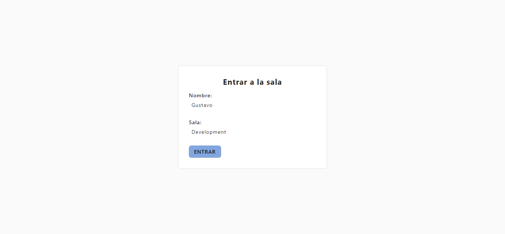
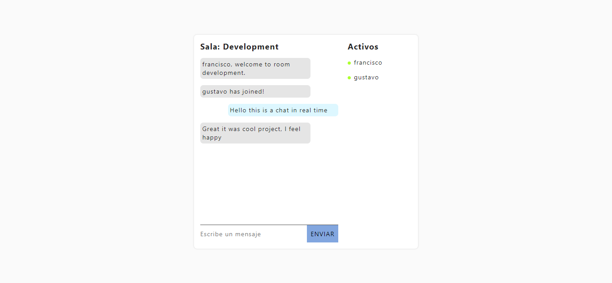
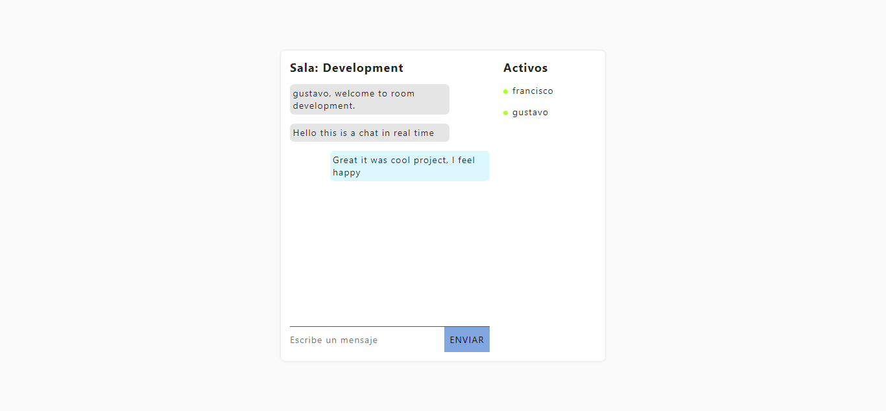

# ChatWithWorld

This repository content two projects
* **Client** is a app created in React using create-react-app

* **Server** is the service backend created with express and config since zero

If it want to more information detail please read the README that is into each project accessing the corresponding folder

##### Note
This idea was taken an of [video](https://www.youtube.com/watch?v=ZwFA3YMfkoc) youtube, the channel is **JavaScript Mastery**. It project will modify for add more value.

## Previews

